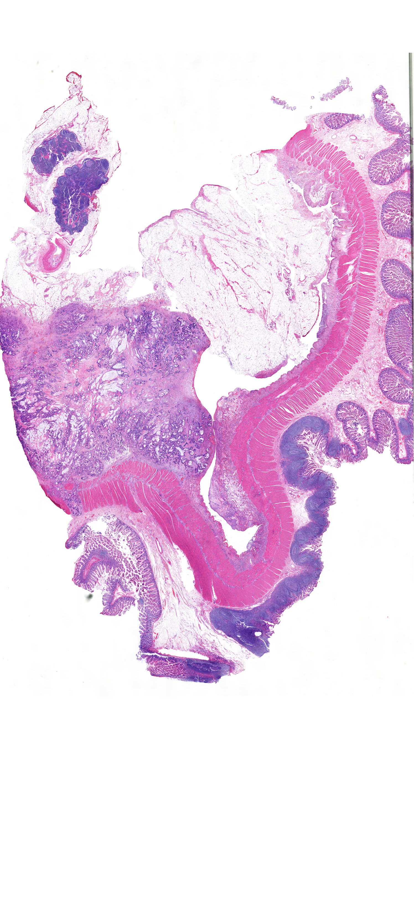

# Two-stage Classification of Thumbnail Whole-slide Pathology Image using Tissue Region Graph Representation and Attention-based Feature Fusion

# 應用組織區域圖與注意力特徵融合機制之兩階段分類網路於數位全玻片病理縮圖影像

這是我的碩士論文，主要是針對病理影像，做良惡性腫瘤的分類。

## Pathology Image Example

<p align="center">
  
</p>

## Structure

```bash
└─ 專案位置/
    ├─ Main/
    |   ├─ build_tg/
    |   ├─ dataset_stage2/
    |   ├─ extracte_emb_s1_gin/
    |   ├─ q_index/
    |   ├─ train_stage1/
    |   └─ train_stage2att/
    └─ enviroment.yml
```

## !!注意事項!!
```bash
    1.和GNN建圖相關的套件版本不能太新，會報錯還會影響效能，請參考 environment.yml.
    2.因為兩階段的設計，所以有兩個訓練流程，另外在消融實驗中加入二階段策略的第二個模型輸入只需放活檢的類別:
        Propose         |Label
        -----------------------------------------------------------
        All dataset     |0:活檢良性，1:活檢惡性，2:切除標本
        Stage1 dataset  |0:活檢，1:切除標本
        Stage2 dataset  |0:良性，1:惡性
    3.因為兩階段的設計，所以一開始就要先切分好資料集，避免兩階段測試集混到訓練集，請參考splits_5foldtest
```

## 主程式使用流程
```bash
1.前處理使用 build_tg.py ，輸入是原始影像(Origin)，輸出是.bin檔(Tissue_Graph).
2.階段一訓練使用 train_stage1.py
3.提取階段一的readout當作後續交叉注意力的Q，使用 extracte_emb_s1_gin.py
4.包含交叉注意力的階段二訓練，使用 train_stage2att.py
```
